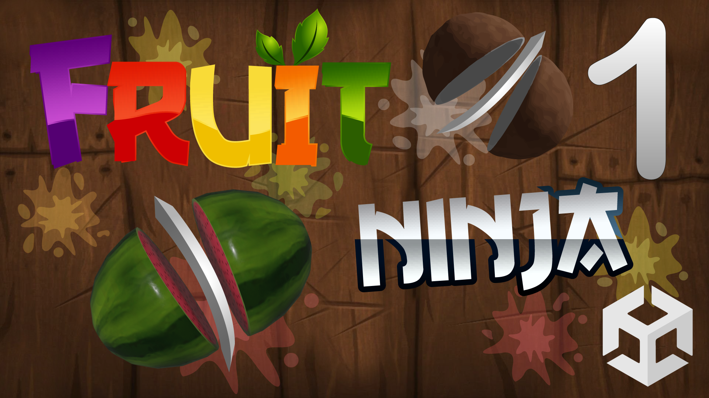

# Fruit Ninja (3D)

Lerne das Mobile Game Fruit Ninja in Unity zu entwickeln. Fruit Ninja wurde von Halfbrick Studios im Jahr 2010 veröffentlicht. In Fruit Ninja zerschneidet der Spieler Obst mit einer Klinge, die er mit seinem Finger über den Touchscreen steuern kann. Ziel des Spiels ist es, möglichst viele Früchte zu zerschneiden und damit viele Punkte zu sammeln.

- Schwierigkeitsgrad: Anfänger
- Themen: 
- Version: 2020.3.26f1
- [🧰 Assets Download](https://github.com/PrezipGames/Fruit-Ninja/blob/main/FruitNinja.unitypackage)
- [🎮 Downloade das ganze Projekt](https://github.com/PrezipGames/Fruit-Ninja/archive/refs/heads/main.zip)
- [🎬 YT Tutorial](https://www.youtube.com/watch?v=t-1n-oEbgEY&t=48s)
- [💬 Joint unserem Discord Server](https://discord.gg/kusy4JQ4)
- [👍 Abonniert um keine Videos zu verpassen](https://www.youtube.com/@prezipgames)

## Viel Spaß beim Entwickeln!
